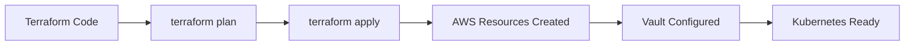

# Architecture Overview

Penn Labs Infrastructure uses a layered architecture that separates infrastructure provisioning, deployment configuration, and CI/CD automation. This design enables teams to manage complex cloud infrastructure while maintaining simplicity for product developers.

## High-Level Architecture

The Penn Labs infrastructure stack consists of four main layers:

1. **Infrastructure Layer (Terraform)** - Provisions and manages AWS resources
2. **Configuration Layer (Kittyhawk)** - Generates Kubernetes deployment manifests
3. **Automation Layer (Kraken)** - Orchestrates CI/CD pipelines
4. **Runtime Layer (Docker + Kubernetes)** - Executes and hosts applications

<Note>
  The architecture follows infrastructure-as-code principles throughout, with all configurations stored in version control and deployed through automated pipelines.
</Note>

## AWS Infrastructure Components

Terraform manages the complete AWS infrastructure stack:

### Compute & Orchestration

**Amazon EKS (Elastic Kubernetes Service)**
- Production Kubernetes cluster for running all Penn Labs applications
- Managed using the official [EKS Terraform module](https://registry.terraform.io/modules/terraform-aws-modules/eks/aws/latest)
- Includes AWS node termination handler for graceful spot instance management
- Bastion host for team leads to exec into pods for administrative tasks

**IAM Roles & Service Accounts**
- Each product has a dedicated IAM role that can be assumed by Kubernetes service accounts
- GitHub Actions has its own IAM role for deployment operations
- Terraform manages role creation and policy attachments automatically

### Data & Storage

**Amazon RDS (PostgreSQL)**
- Managed PostgreSQL cluster with automated backups
- Database credentials stored in Vault with random master password generation
- Per-product databases, roles, and grants managed by Terraform
- Daily backups to S3 via custom `pg-s3-backup` Docker image

**Amazon S3**
- Terraform state backend for distributed state management
- Database backup storage at `sql.pennlabs.org`
- Static asset hosting for products

### Networking

**Amazon VPC**
- Isolated network environment using the [VPC Terraform module](https://registry.terraform.io/modules/terraform-aws-modules/vpc/aws/latest)
- Public and private subnets across multiple availability zones
- NAT gateways for outbound internet access from private subnets

**Route53**
- DNS management for all product domains (`*.pennlabs.org`)
- Automated DNS entries for load balancers and services
- ACME challenge records for TLS certificate validation

**Elastic Load Balancing**
- Traefik ingress controller manages application routing
- TLS termination with certificates from cert-manager
- Load balancer DNS automatically configured in Route53

### Security & Secrets

**HashiCorp Vault**
- Centralized secrets management for all applications
- Runs on dedicated EC2 instance with the official Vault AMI
- TLS certificate provisioned by AWS Certificate Manager
- Application Load Balancer terminates TLS and forwards to Vault instance
- KMS key integration for auto-unseal
- AWS auth method for Kubernetes service account authentication

<Info>
  Vault secrets are automatically synced to Kubernetes using the `secret-sync` cronjob, which regularly reads from Vault and updates cluster secrets.
</Info>

## Deployment Pipeline

The deployment pipeline integrates multiple tools to automate the path from code to production:

### 1. Infrastructure Provisioning (Terraform)



Terraform provisions the foundational infrastructure:
- Creates VPC, subnets, and networking components
- Deploys EKS cluster with node groups
- Sets up RDS databases with credentials stored in Vault
- Configures IAM roles and policies
- Installs base cluster components (Traefik, cert-manager, monitoring)

### 2. Application Configuration (Kittyhawk)

Kittyhawk converts TypeScript definitions into Kubernetes YAML:

```typescript
// Define deployment in TypeScript
new DjangoApplication(this, 'django-asgi', {
  deployment: {
    image: backendImage,
    cmd: ['/usr/local/bin/asgi-run'],
    replicas: 2,
    secret: secret,
  },
  djangoSettingsModule: 'example.settings.production',
  domains: [{ host: domain, paths: ['/api/ws'] }],
});
```

**Benefits:**
- Type-safe configuration with IDE support
- Reusable constructs for common patterns (Django, React, Redis, CronJobs)
- Automatic generation of Deployments, Services, and Ingress resources
- Environment variables like `GIT_SHA` and `RELEASE_NAME` automatically injected

### 3. CI/CD Orchestration (Kraken)

Kraken generates GitHub Actions workflows using CDK for Actions:

```javascript
new LabsApplicationStack(app, {
  djangoProjectName: 'exampleDjangoProject',
  dockerImageBaseName: 'example-product',
});
```

**Generated workflow:**
1. Lint code (Django: `black`, `flake8`; React: ESLint)
2. Run tests (Django: pytest; React: Jest)
3. Build Docker images
4. Push images to Docker Hub with commit SHA tags
5. Generate Kubernetes YAML using Kittyhawk
6. Deploy to cluster using `kubectl apply`

### 4. Runtime Execution (Docker + Kubernetes)

Applications run in the EKS cluster:
- **Docker images** built from custom base images (e.g., `django-base`)
- **Kubernetes Deployments** manage pod replicas and rolling updates
- **Kubernetes Services** provide stable networking endpoints
- **Traefik Ingress** routes external traffic to services
- **Secrets** automatically synced from Vault to Kubernetes

## How the Tools Work Together

The complete flow from infrastructure setup to application deployment:

```
┌─────────────────────────────────────────────────────────────┐
│ 1. Terraform provisions AWS infrastructure                  │
│    • EKS cluster, RDS, VPC, Vault, IAM roles                │
└─────────────────────┬───────────────────────────────────────┘
                      │
                      ▼
┌─────────────────────────────────────────────────────────────┐
│ 2. Developers write application code                        │
│    • Django backend in backend/                             │
│    • React frontend in frontend/                            │
│    • Kittyhawk config in k8s/                               │
│    • Kraken config in .github/cdk/                          │
└─────────────────────┬───────────────────────────────────────┘
                      │
                      ▼
┌─────────────────────────────────────────────────────────────┐
│ 3. Push to GitHub triggers Kraken workflow                  │
│    • Lint & test code                                       │
│    • Build Docker images                                    │
│    • Publish to Docker Hub                                  │
└─────────────────────┬───────────────────────────────────────┘
                      │
                      ▼
┌─────────────────────────────────────────────────────────────┐
│ 4. Deploy job runs Kittyhawk                                │
│    • Generate Kubernetes YAML from TypeScript               │
│    • Apply manifests to EKS cluster                         │
└─────────────────────┬───────────────────────────────────────┘
                      │
                      ▼
┌─────────────────────────────────────────────────────────────┐
│ 5. Kubernetes orchestrates deployment                       │
│    • Pull Docker images from Docker Hub                     │
│    • Inject secrets from Vault                              │
│    • Rolling update with zero downtime                      │
│    • Traefik routes traffic to new pods                     │
└─────────────────────────────────────────────────────────────┘
```

<Note>
  Each layer is independent and can be updated separately. For example, Terraform changes don't require redeploying applications, and application deployments don't require Terraform changes.
</Note>

## State Management

**Terraform State**
- Stored in S3 backend with encryption
- DynamoDB table for state locking (prevents concurrent modifications)
- Shared across team members for collaborative infrastructure management

**Kubernetes State**
- Managed by Kubernetes control plane in EKS
- Declarative manifests applied via `kubectl apply`
- GitOps workflow ensures cluster state matches version control

**Secrets State**
- Vault is the source of truth for all secrets
- `secret-sync` cronjob propagates changes to Kubernetes
- Terraform manages database credentials and stores them in Vault
- GitHub organization secrets managed separately for CI/CD

## Access Control & Security

**Multi-Layer Authentication:**
1. **AWS IAM** - Controls access to AWS resources
2. **Kubernetes RBAC** - Controls access within the cluster
3. **Vault Policies** - Controls access to secrets
4. **GitHub Teams** - Controls deployment permissions

**Team Sync:**
- Automatically syncs GitHub team membership to Vault policies
- Grants appropriate access to Bitwarden and Django admin consoles
- Ensures team leads have the necessary cluster access

<Info>
  All components follow the principle of least privilege, with each service having only the permissions it needs to function.
</Info>

## Monitoring & Operations

**Grafana Dashboards:**
- Traefik metrics for request rates and latencies
- Pod resource usage and health status
- Certificate expiration monitoring
- Automated alerts for abnormal conditions

**Operational Tools:**
- `team-sync` - Syncs GitHub teams to Vault policies
- `db-backup` - Daily PostgreSQL backups to S3
- `renovate` - Automated dependency updates
- Bastion host for administrative access

## Next Steps

Now that you understand the architecture, explore specific components:

- **[Terraform Configuration](/terraform/overview)** - Learn how to manage AWS infrastructure
- **[Kittyhawk Guide](/kittyhawk/overview)** - Create Kubernetes deployments with TypeScript
- **[Kraken Setup](/kraken/overview)** - Configure GitHub Actions workflows
- **[Operations](/operations/secrets)** - Manage secrets and access control
- **[Bootstrapping](/operations/bootstrapping)** - Set up infrastructure from scratch